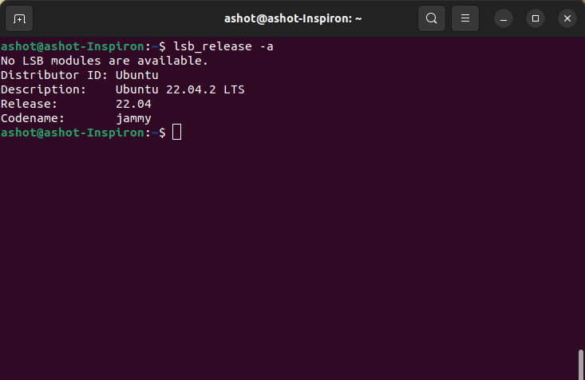
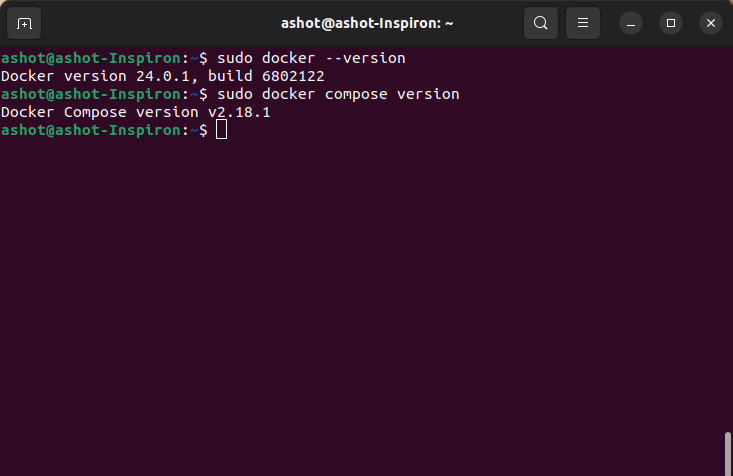

# Homework for the intro part:

Here is the version of the Ubuntu that I installed with my Windows as Dual Boot:
[ubuntu_version](screenshots/ubuntu_version.png)

Here are the versions for the docker and docker compose:
[docker_docker_compose](screenshots/docker_docker_compose.png)

