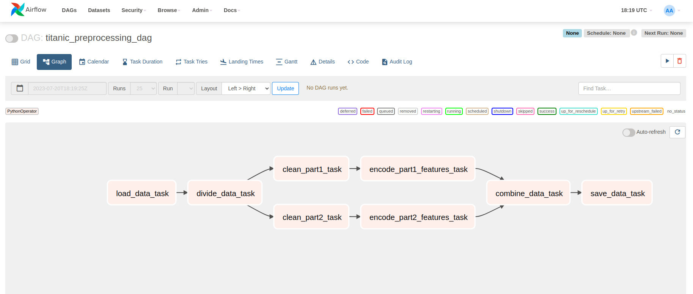

### Local application

First we install the Airflow with the command
```bash
    pip install apache-airflow
```

We create a folder named "airflow" for the db information
```bash
    mkdir airflow
    cd airflow
    export AIRFLOW_HOME="$(pwd)"
```
Also set in airflow.cfg file the directory for your dags by setting "dags_folder"

After, we initialize the database with this command
```bash
    airflow db init
```
Now we create a Admin user to be able to log in to the Airflow UI.
```bash
    airflow users  create --role Admin --username admin --email admin --firstname admin --lastname admin --password admin
```
With this command we run the server of the Airflow service
```bash
    airflow webserver -p 8080
```
Parallelly, we run in the terminal the scheduler to be able to see our dags
```bash
    airflow scheduler
```

After you log in into the Airflow UI you can see the dag that we created and run it:
[dag_graph](Pipeline_Airflow/screenshots/dag_example.png) 
\



### Application in Docker
I also created a docker-compose.yml for the implementation in dockers that would make the usage easier 
It is not tested yet, but you can find the docker-compose.yml file in the Pipeline_Airflow directory.


### Notes
I will further add details in the documentation.

